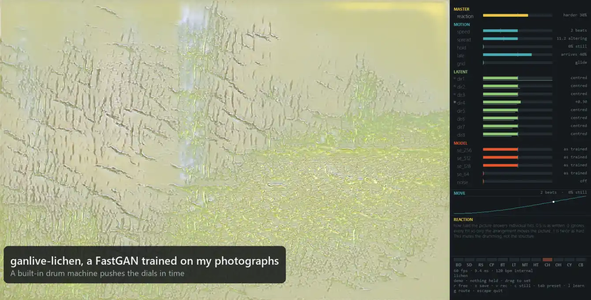

# ganlive

**Plug-and-play GAN exploration in real time.**

Explore a GAN's latent space with automatically derived dials, played by hand, with MIDI, or from drums, on any GPU.

<p align="center">
  <a href="docs/demo.mp4"></a>
</p>

## Quick start

Requires Python 3.10–3.13 and [uv](https://docs.astral.sh/uv/getting-started/installation/).
Supports Windows, macOS, and Linux, with NVIDIA, AMD, Intel, and Apple GPU backends or CPU.
[FastGAN models](https://huggingface.co/collections/gustavecortal/ganlive-6ac56a61006a78b3e1ff5406) run at over 100 fps in 3072×2048 on a $350 GPU.

### 1. Install

```bash
git clone https://github.com/gustavecortal/ganlive.git
cd ganlive
uv venv --python 3.12
```

Install [PyTorch for your hardware](https://pytorch.org/get-started/locally/)
with `uv pip install`, then install ganlive:

```bash
uv pip install -e ".[record]"
```

[GPU setup and optional features →](docs/guide.md#install)

### 2. Load a model

Try NVIDIA's StyleGAN2 face model:

```bash
git clone --depth 1 https://github.com/NVlabs/stylegan2-ada-pytorch
uv pip install requests click setuptools
curl -L -o ffhq.pkl https://nvlabs-fi-cdn.nvidia.com/stylegan2-ada-pytorch/pretrained/ffhq.pkl
uv run --no-sync ganlive import-stylegan2 ffhq.pkl --repo stylegan2-ada-pytorch
```

### 3. Explore

```bash
uv run --no-sync ganlive play --checkpoint runs/stylegan2/ffhq.pt --console --no-audio --no-midi
```

Drag the dials beside the image. The first launch may take a minute or two to compile.

## Controls

| Action | Control |
|---|---|
| Adjust a dial | Drag or scroll |
| Release a dial | Right-click |
| Map a MIDI knob | Touch a dial, press `l`, then turn the knob |
| Route MIDI notes | `g` |
| Choose a model | `m` |
| Change preset | `Tab` |
| Save image / record video | `c` / `v` |
| Quit | `Esc` |

For MIDI, remove `--no-midi`. To use notes, map them to tracks and press `g` to connect
those tracks to dials:

```bash
uv run --no-sync ganlive play --checkpoint runs/stylegan2/ffhq.pt --console --no-audio --notes 36=BD,38=SD,42=CH
```

MIDI clock keeps movement in time with your device.
[More controls and MIDI setup →](docs/guide.md#playing-with-hardware)

## Bring your own GAN

| Model | Load with |
|---|---|
| **StyleGAN2** | `ganlive import-stylegan2 model.pkl --repo stylegan2-ada-pytorch` |
| **FastGAN** | A [gantrain](https://github.com/gustavecortal/gantrain) checkpoint or a published one: [ganlive-lichen](https://huggingface.co/gustavecortal/ganlive-lichen), [ganlive-amber](https://huggingface.co/gustavecortal/ganlive-amber) |
| **Other GANs** | `ganlive adopt model.onnx` or `ganlive adopt hf:owner/repo` |

Other generators need a compatible ONNX export or Hub repository.
Install `.[onnx]` for ONNX or `.[hub]` for Hub imports.

[Model setup and examples →](docs/guide.md#models)

## Learn more

[User guide](docs/guide.md) · [Automatic dials](docs/guide.md#how-the-dials-are-found) ·
[Performance](docs/guide.md#speed) · [Development](docs/guide.md#development) ·
[Related work](docs/guide.md#related-work) · [Citation](CITATION.cff)

## License

[MIT](LICENSE). Model weights retain their original licenses.
